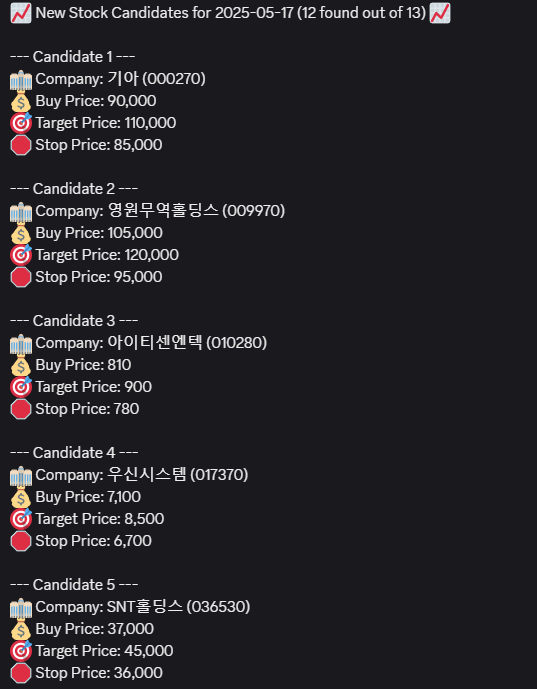

# LLM-Powered Automated Stock Trading Bot

This project is an automated trading bot that leverages a Large Language Model (LLM) to analyze and trade stocks on the Korea Exchange (KRX) using the Korea Investment & Securities (KIS) API.



***

### How It Works

The bot operates in a fully automated, multi-stage cycle, preparing data and executing trades based on a daily schedule.

**Stage 1: Foundational Data Sync (Weekly)**
-   **When:** Every Monday at 5:00 AM.
-   **What:** The system automatically fetches a comprehensive list of all publicly listed corporations from DART (Korea's corporate filing system). This master list is stored in the `CorporateInfo` table, serving as the foundation for all other operations.

**Stage 2: Daily Market Data Collection (Post-Market)**
-   **When:** Every weekday at 4:00 PM (after market close).
-   **What:** The bot retrieves the day's closing quote for every company in the master list. This includes price, volume, market capitalization, and key financial indicators like PER and PBR. The fresh market data is saved to the `CorporateQuote` table.

**Stage 3: LLM-Powered Candidate Selection (Pre-Market)**
-   **When:** Every weekday at 7:00 AM.
-   **What:** Using the data collected the previous afternoon, the system filters for promising companies based on fundamental metrics. For each filtered company, it gathers further details (financial reports, chart data) and feeds them into an LLM. The LLM analyzes this information to determine optimal entry, target, and stop-loss prices. The final candidates are stored in the database, and a notification is sent to Discord.

**Stage 4: Automated Trading (Market Hours)**
-   **When:** Every weekday from 9:00 AM to 3:30 PM.
-   **What:** The trading engine activates, loading the candidates generated by the LLM. It continuously monitors the market and automatically executes buy orders via the KIS API if a stock's price hits its predetermined entry point. The session terminates automatically at market close.

***

### Tech Stack

-   **Language**: Python 3.11
-   **Package Management**: uv
-   **Frameworks & Libraries**:
    -   **LLM Integration**: LangChain, Langchain-OpenAI
    -   **Financial APIs**: python-kis (for KIS API), DART requests
    -   **Scheduling**: APScheduler
    -   **Data Handling**: Pandas
    -   **Database**: SQLAlchemy, mysqlclient
-   **Development**: Ruff, Pytest

#### **Installation & Setup**

1.  **Clone the repository:**
    ```bash
    git clone [https://github.com/taeyoungson/trader.git](https://github.com/taeyoungson/trader.git)
    cd trader
    ```

2.  **Create and activate the virtual environment using `uv`:**
    ```bash
    uv venv
    source .venv/bin/activate
    ```

3.  **Install dependencies from `pyproject.toml`:**
    ```bash
    uv pip install -e .
    ```

4.  **Configure Environment:**
    -   Set up your environment variables for the database connection, KIS API keys, and OpenAI API key into `.env` file.

#### **Running the Bot**

-   Launch the main application to start the background scheduler.
    ```bash
    # if you set up your python environment successfully,
    python -m core.scheduler
    
    # if not
    uv run python -m core.scheduler
    ```

The scheduler will then handle the daily execution of the entire data pipeline and trading logic.

